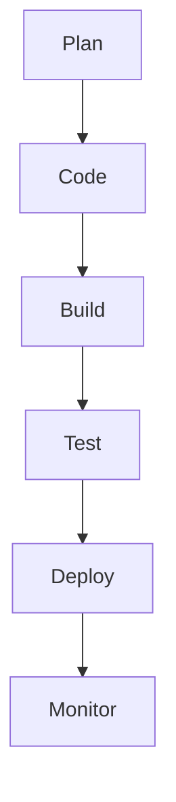

# วงจร DevOps

คำอธิบายโดยย่อ:

* **Plan** วางแผนงาน, ออกแบบระบบ
* **Code** พัฒนา, จัดเก็บโค้ดบน Git
* **Build/Test** สร้าง/ทดสอบอัตโนมัติใน CI
* **Deploy** ส่งขึ้นเครื่องเซิร์ฟเวอร์ด้วย CD
* **Monitor** เก็บตัวชี้วัดและบันทึก log เพื่อปรับปรุง
