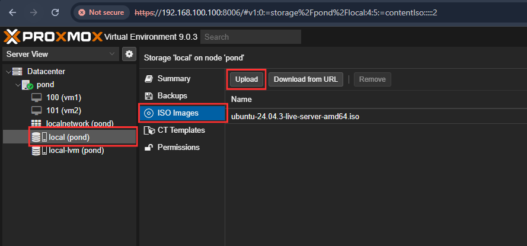
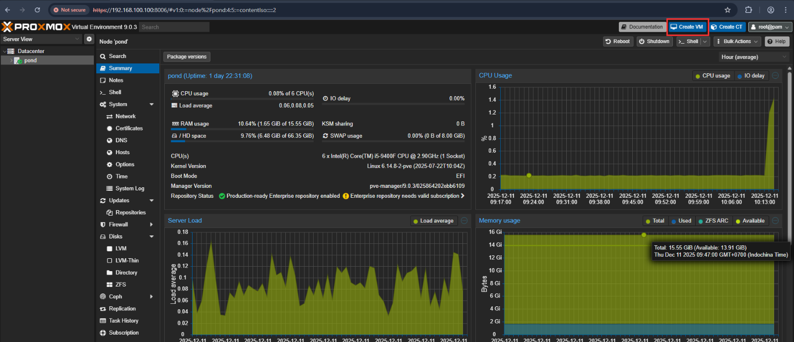
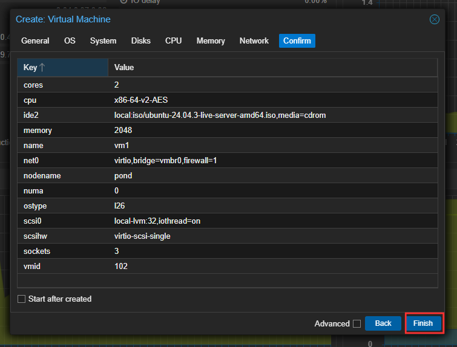
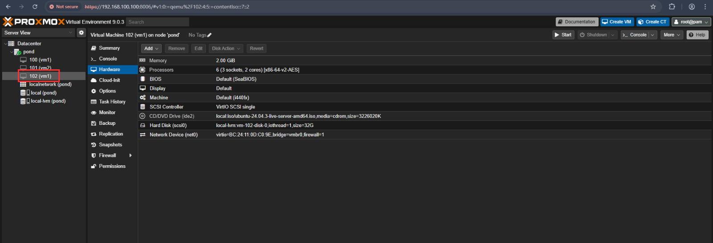

# เข้า Web UI ของ Proxmox เพื่ออัพ iso

### อัปโหลด ISO ไว้ใน local

<figure><figcaption></figcaption></figure>

### ให้เราเลือก Ubuntu Serverไฟล์ที่เตรียม

<figure><figcaption></figcaption></figure>

### หน้าสร้าง VM บน Proxmox

<figure><figcaption></figcaption></figure>

### หน้ากำหนด VM ID เเละ Name VM เลือก iso ที่อัพไว้&#x20;

<figure><figcaption></figcaption></figure>

### เลือก Disk size ให้เหมาะสมกับงาน

<figure><figcaption></figcaption></figure>

### เลือก Sockets เเละ Cores ให้เหมาะกับทรัพยากร

<figure><figcaption></figcaption></figure>

### เช็ค Config ว่าตั้งอะไรบ้างเเล้วกด Finish

<figure><figcaption></figcaption></figure>

### เราก็จะได้ VM ขึ้นมาอยู่ Server&#x20;

<figure><figcaption></figcaption></figure>

> เเนะนำเครื่อง Server RAM 16 GB Disk 80 GB ขึ้นไป&#x20;
