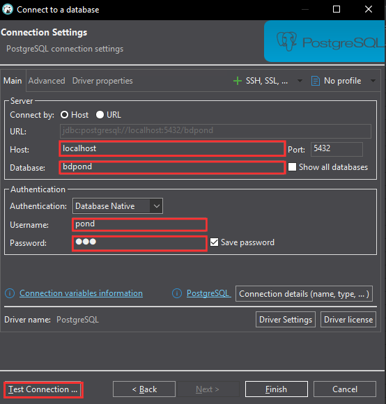
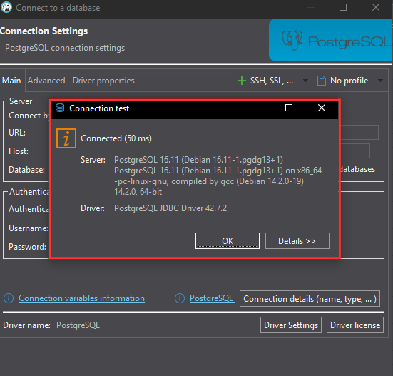
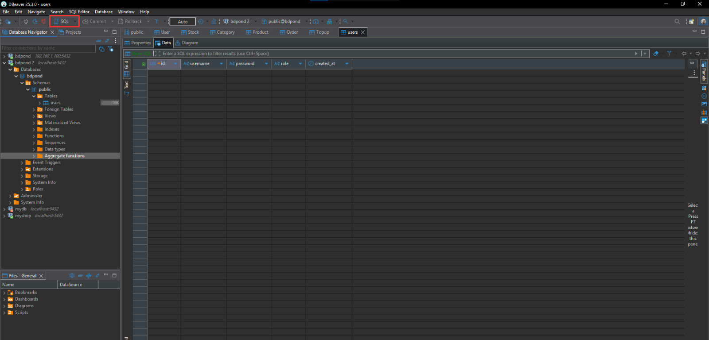
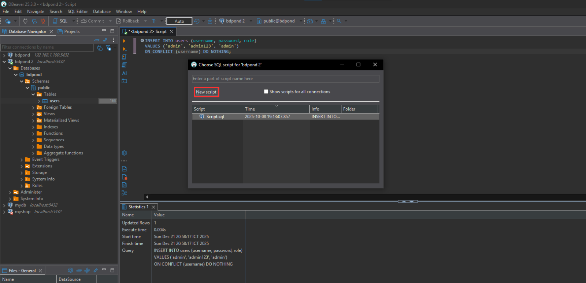
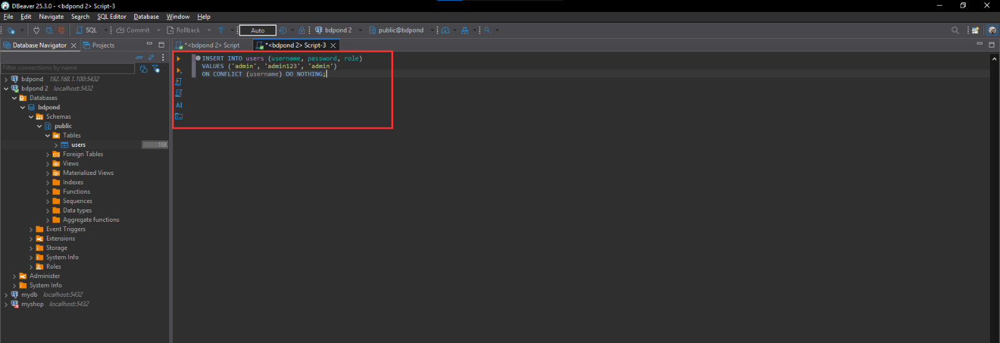

# สร้าง DataBase เเละ การสร้าง table

สร้างไฟล์ `docker-compose.yml` ใน repo เรา

```shellscript
version: "3.8"                     # ระบุเวอร์ชันของ docker-compose ที่ใช้

services:
  db:                              # ชื่อ service (เรียกใช้อ้างอิงภายใน compose)
    image: postgres:16             # ใช้ Docker image PostgreSQL เวอร์ชัน 16
    container_name: postgres-db    # ตั้งชื่อ container ให้จำง่าย
    restart: always                # ถ้า container หยุด จะพยายามรันใหม่อัตโนมัติ

    environment:                   # ตัวแปรสภาพแวดล้อมสำหรับตั้งค่า PostgreSQL
      POSTGRES_USER: pond          # ชื่อผู้ใช้ฐานข้อมูล
      POSTGRES_PASSWORD: 123       # รหัสผ่านของผู้ใช้ฐานข้อมูล
      POSTGRES_DB: bdpond          # ชื่อฐานข้อมูลเริ่มต้นที่สร้างอัตโนมัติ

    ports:
      - "5432:5432"                # map port: host:container
                                   # ทำให้เครื่องภายนอกเชื่อมต่อ DB ได้ที่ port 5432

    volumes:
      - pgdata:/var/lib/postgresql/data
                                   # เก็บข้อมูลฐานข้อมูลไว้ใน volume
                                   # เพื่อไม่ให้ข้อมูลหายเมื่อ container ถูกลบ

volumes:
  pgdata:                          # ประกาศ volume สำหรับเก็บข้อมูล PostgreSQL
                                   # เป็น persistent storage (ข้อมูลไม่หาย)
```

เเละrun คำสั่ง `docker compose up -d` เพื่อสร้างฐานข้อมูลเริ่มต้นที่สร้างอัตโนมัติ

<div align="left"><figure><figcaption></figcaption></figure></div>

ต่อมาให้เราสร้างไฟล์ db.js ใน folder config เพื่อเราทำการเชื่อมต่อฐานข้อมูลก็คือ DataBase ที่เราสร้างมา

```javascript
// ดึงคลาส Pool จากไลบรารี pg (PostgreSQL client สำหรับ Node.js)
const { Pool } = require('pg');

// สร้าง connection pool สำหรับเชื่อมต่อฐานข้อมูล PostgreSQL
const pool = new Pool({
  host: 'localhost',     // ที่อยู่ของ PostgreSQL (ถ้าใช้ Docker อาจเป็นชื่อ service)
  port: 5432,            // port ของ PostgreSQL
  user: 'pond',          // ชื่อผู้ใช้ฐานข้อมูล
  password: '123',       // รหัสผ่านของผู้ใช้
  database: 'bdpond'     // ชื่อฐานข้อมูลที่ต้องการเชื่อมต่อ
});

// ทดสอบการเชื่อมต่อฐานข้อมูลทันทีเมื่อแอปเริ่มทำงาน
(async () => {
  try {
    // ส่งคำสั่ง SQL เพื่อทดสอบว่าเชื่อมต่อฐานข้อมูลได้หรือไม่
    const result = await pool.query('SELECT NOW()');

    // แสดงข้อความเมื่อเชื่อมต่อสำเร็จ
    console.log('DB connected successfully');
  } catch (err) {
    // แสดงข้อความเมื่อเชื่อมต่อไม่สำเร็จ
    console.error('DB connection error:', err.message);
  }
})();

// export pool เพื่อให้ไฟล์อื่นนำไปใช้ query ฐานข้อมูลได้
module.exports = pool;
```

ต่อมาเราจะมาทดสอบว่าเชื่อม database สำเร็จไหมให้เราสร้างไฟล์ server.js ขึ้นมา

```javascript
// เรียกใช้งาน Express framework
const express = require('express');

// สร้าง instance ของ Express application
const app = express();

// เรียกไฟล์เชื่อมต่อฐานข้อมูล PostgreSQL
// เมื่อไฟล์นี้ถูกเรียก จะทำการเชื่อมต่อ DB และแสดง log การเชื่อมต่อทันที
require('./config/db');

// สร้าง route สำหรับทดสอบว่า server ทำงานได้ปกติหรือไม่
app.get('/', (req, res) => {
  // ส่งข้อความตอบกลับไปยัง client
  res.send('ทดสอบการเชื่อมต่อเซิร์ฟเวอร์สำเร็จ');
});

// กำหนด port ที่ server จะใช้งาน
const PORT = 3000;

// เริ่มรัน server และฟังการเชื่อมต่อที่ port ที่กำหนด
app.listen(PORT, () => {
  // แสดงข้อความเมื่อ server เริ่มทำงานสำเร็จ
  console.log(`✅ Server running at http://localhost:${PORT}`);
});
```

การทำการทดสอบให้ติดตั้ง `apt install nodejs` ก่อน เเละใช้คำสั่ง node server.js มันก็จะขึ้น log ที่เราเขียนไว้\
`✅ Server running at http://localhost:3000`
\
`DB connected`&#x20;

<figure><figcaption></figcaption></figure>

เเละเข้า [http://localhost:3000/](http://localhost:3000/) ทดสอบว่าข้อความที่เราทำไว้เช็คขึ้นไหม

```javascript
// สร้าง route สำหรับทดสอบว่า server ทำงานได้ปกติหรือไม่
app.get('/', (req, res) => {
  // ส่งข้อความตอบกลับไปยัง client
  res.send('ทดสอบการเชื่อมต่อเซิร์ฟเวอร์สำเร็จ');
});
```

<figure><figcaption></figcaption></figure>

> ถ้าได้เเบบเเปลว่าเราเชื่อมต่อสำเร็จเเล้ว🎉🎉[^1]

### การสร้างตารางเเบบอัตโนมัติ

ให้เรากลับไปที่ folder config เเล้วสร้างไฟล์ init\_db.js เเล้วสร้างไฟล์ create\_users.sql ไว้ใน folder sql&#x20;

<pre class="language-sql"><code class="lang-sql"><strong>--folder sql 
</strong><strong>-- สร้างตาราง users ถ้ายังไม่มี
</strong>CREATE TABLE IF NOT EXISTS users (
  id SERIAL PRIMARY KEY,                 -- id อัตโนมัติ เป็น primary key
  username VARCHAR(100) UNIQUE NOT NULL, -- ชื่อผู้ใช้ ห้ามซ้ำ
  password VARCHAR(255) NOT NULL,        -- รหัสผ่าน (ควรเก็บแบบ hash)
  role VARCHAR(50) DEFAULT 'user',       -- บทบาทผู้ใช้ (user / admin)
  created_at TIMESTAMP DEFAULT NOW()     -- วันเวลาที่สร้างข้อมูล
);
</code></pre>

ให้เรากลับไปที่ folder config เเล้วสร้างไฟล์ init\_db.js&#x20;

```javascript
// เรียกใช้งาน module สำหรับอ่านไฟล์
const fs = require('fs');

// ใช้จัดการ path ของไฟล์ให้ถูกต้องทุก OS
const path = require('path');

// เรียก pool สำหรับเชื่อมต่อ PostgreSQL
const pool = require('./db');

// ฟังก์ชันสำหรับรันไฟล์ SQL
const run = async (file) => {
  // อ่านไฟล์ SQL จากโฟลเดอร์ sql
  const sql = fs.readFileSync(
    path.join(__dirname, `../sql/${file}`),
    'utf8'
  );

  // ส่งคำสั่ง SQL ไปให้ PostgreSQL ทำงาน
  await pool.query(sql);

  // แสดง log เมื่อรันไฟล์สำเร็จ
  console.log(`✅ ran ${file}`);
};

// ฟังก์ชันหลักสำหรับ init database
(async () => {
  try {
    // รันไฟล์สร้างตาราง users
    await run('create_users.sql');

    // แสดงข้อความเมื่อทุกตารางพร้อมใช้งาน
    console.log('✅ tables ready');
  } catch (err) {
    // แสดง error ถ้ามีปัญหา
    console.error('❌ init_db error:', err.message);
  }
})();

```

เเละเพื่อให้สร้างตารางตอนrun server เลยให้ไปที่ไฟล์ server.js เพิ่ม `require('./config/init_db');`

```javascript
const express = require('express');
const app = express();
require('./config/db');
require('./config/init_db'); // เรียก init_db.js เข้ามา (มันจะสร้างตารางให้เอง)

app.get('/', (req, res) => {
  res.send('ทดสอบการเชื่อมต่อเซิร์ฟเวอร์สำเร็จ');
});

const PORT = 3000;
app.listen(PORT, () => {
  console.log(`Server running at http://localhost:${PORT}`);
});

```

เเล้วลองรันอีกรอบถ้า log ขึ้นเเบบนี้เเสดงว่าตารางถูกสร้างเเล้ว

<div align="left"><figure><figcaption></figcaption></figure></div>

ต่อมาเราจะเช็คว่าตารางมาจริงรึเปล่าผมใช้  dbeaver ในการเช็คให้เราโหลดมาเเละติดตั้ง

<figure><figcaption></figcaption></figure>

วิธีการใช้

<figure><figcaption></figcaption></figure>

กดเข้ามาใน New database ให้ใส่ตามที่สร้างในไฟล์ `docker-compose.yml`

<div align="left"><figure><figcaption></figcaption></figure></div>

พอเรากด Test Connection เสร็จเเบบนี้คือผ่านเเล้วกด Finish

<div align="left"><figure><figcaption></figcaption></figure></div>

เเล้วกดมาดูที่ Table ว่ามีตารางขึ้นไหมถ้ามีเป็นอันเสร็จเเค่นี้เราก็สามารถเพิ่ม user ไว้ทำ login ได้เเล้ว

<figure><figcaption></figcaption></figure>

ให้เราอยู่ที่ Dbeaver เเล้วกด SQL

<div align="left"><figure><figcaption></figcaption></figure></div>

กด new script เพื่อจะเพิ่ม user เเละ role

<div align="left"><figure><figcaption></figcaption></figure></div>

```sql
INSERT INTO users (username, password, role)
VALUES ('admin', 'admin123', 'admin')
ON CONFLICT (username) DO NOTHING;

-- เพิ่มข้อมูลผู้ใช้ใหม่ลงในตาราง users
INSERT INTO users (username, password, role)

-- กำหนดค่าของแต่ละคอลัมน์ตามลำดับ
VALUES (
  'admin',        -- username: ชื่อผู้ใช้ระดับผู้ดูแลระบบ
  'admin123',     -- password: รหัสผ่าน (ตัวอย่าง ใช้สำหรับ Dev / Lab)
  'admin'         -- role: กำหนดสิทธิ์เป็น admin
)

-- ถ้า username ซ้ำกับข้อมูลที่มีอยู่แล้ว
-- จะไม่เพิ่มข้อมูลใหม่ และไม่เกิด error
ON CONFLICT (username) DO NOTHING;

```

เเล้วกดรันเเล้วกลับไปดูที่ table user ว่ามี user มาเเล้วหรือยัง<br>

<figure><figcaption></figcaption></figure>

ก็ได้ user เเบบนี้เลยถ้าไม่มีให้กด refresh นึงทีก็จะได้เเล้ว

<figure><figcaption></figcaption></figure>

### ต่อไปเราจะเปลี่ยน hash password กัน

โดยผมจะสร้างuser บน Dbeaver เลยโดนใช้เมนู SQL เเละติดตั้ง bcrypt (ในโปรเจกต์ backend)\
`npm install bcrypt`

<div align="left"><figure><figcaption></figcaption></figure></div>

สร้าง hash password “ทันที” บน Ubuntu

```shellscript
node -e "const bcrypt=require('bcrypt'); bcrypt.hash('admin123',10).then(h=>console.log(h))"
#'admin123' = รหัสผ่านจริง

#10 = salt rounds (มาตรฐาน)

#ผลลัพธ์ = bcrypt hash
```

ตัวอย่าง output

```shellscript
$2b$10$Z4nYkXq5g0Q6sV6kYfZCRePpJ7y1K8Jp3oZzH6G4qPZz6dRzZQ8sK
#คัดลอก hash นี้ไว้
```

กลับไปที่ Dbeaver เข้า SQL ใช้คำสั่งนี้เพื่อสร้าง user เเละสร้าง hash password

```sql
INSERT INTO users (username, password, role)
VALUES (
  'admin', 
  '$2b$10$Z4nYkXq5g0Q6sV6kYfZCRePpJ7y1K8Jp3oZzH6G4qPZz6dRzZQ8sK',
  'admin'
)
ON CONFLICT (username) DO NOTHING;

```

<figure><figcaption></figcaption></figure>

เราก็จะได้รหัสผ่านเเบบ hash password&#x20;

<figure><figcaption></figcaption></figure>

> ถ้าขึ้นเเบบนี้คือได้เเล้ว

[^1]: 
