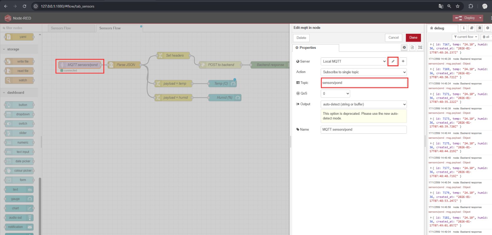
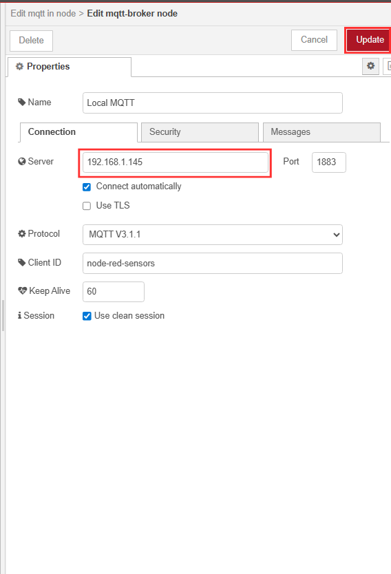
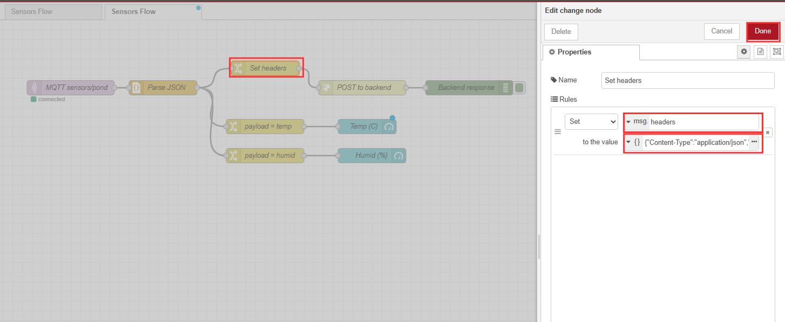
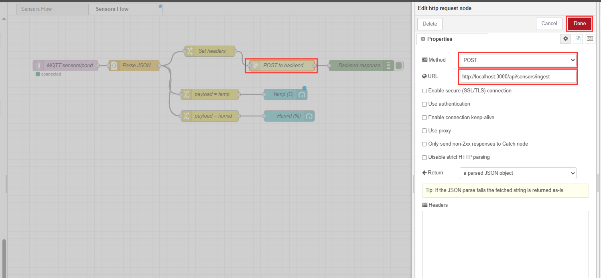
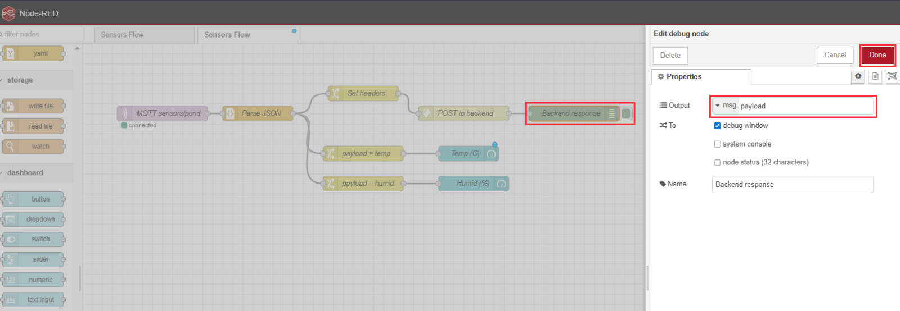

# วิธีการใช้ Node Red

ให้เรารัน node red เเล้วเข้าตาม Server now running at http://127.0.0.1:1880/

<figure><figcaption></figcaption></figure>

เเล้วก็เข้าก็จะได้หน้าตาเเบบนี้ให้เราลง dashboard ก่อนไปที่ตั้งค่า

<figure><figcaption></figcaption></figure>

เเละเข้าไป Manage palette

<figure><figcaption></figcaption></figure>

กดไปที่ Install&#x20;

<figure><figcaption></figcaption></figure>

เเล้วกดค้นหา dashboard

<figure><figcaption></figcaption></figure>

ก็จะได้เครื่องมือมาใช้งาน dashboard

<div align="left"><figure><figcaption></figcaption></figure></div>

ไปที่หัวข้อ network เเล้วเอา mqtt in ลากลงมาวางได้เลย

<figure><figcaption></figcaption></figure>

ตั้งค่า MQTT Broker **Server**: `192.168.1.145` (IP เครื่องที่รัน Mosquitto/Broker)

<div align="left"><figure><figcaption></figcaption></figure></div>

Parse JSON จุดนี้สำคัญมาก เพราะ MQTT ส่วนใหญ่ส่งมาเป็นข้อความ JSON

```shellscript
{ temp: 24.1, humid: 37, ... } ###ผลลัพธ์: msg.payload
```

<figure><figcaption></figcaption></figure>

Set headers หนด `Set headers` คือการตั้ง header ให้ HTTP request ส่งแบบ JSON ตั้งค่า **`msg.headers`**

```json
{"Content-Type":"application/json","X-Sensor-Secret":"pond-ingest-secret"}
```

<figure><figcaption></figcaption></figure>

POST to backend  โหนดนี้คือส่งข้อมูลเข้า Backend API

<figure><figcaption></figcaption></figure>

Backend response **debug node** เอาไว้ดูผลลัพธ์ที่ backend ส่งกลับ

<figure><figcaption></figcaption></figure>

payload = temp / payload = humid\
ดยทั่วไปจะตั้งใน Change node แบบนี้:

* `payload = temp` : ตั้ง `msg.payload` = `msg.payload.temp`
* `payload = humid`: ตั้ง `msg.payload` = `msg.payload.humid`

จากนั้นส่งเข้า `Temp (C)` และ `Humid (%)` (ui gauge) ก็จะแสดงค่าล่าสุดแบบเรียลไทม์

<figure><figcaption></figcaption></figure>

โหนดนี้เอาค่าความชื้นออกมาจากข้อมูล JSON ที่ parse แล้ว\
หลัง Parse JSON จะได้ msg payload เป็น object เช่น temp และ humid อยู่ข้างใน\
แต่เกจต้องการตัวเลขอย่างเดียว

ตั้งค่าให้ Set msg payload เป็น msg payload humid\
แปลว่าเอาค่า humid ออกมาแล้วเขียนทับ msg payload ให้เหลือเป็นเลขล้วน\
จากนั้นส่งเข้าเกจ Humid % ก็จะแสดงได้ทันที

```json
msg.payload = { temp: 24.1, humid: 36, ... }
```

<figure><figcaption></figcaption></figure>

*   **Group: `[Sensors] Realtime`**\
    คือ “กลุ่ม” บนหน้า Dashboard ว่าวิดเจ็ตนี้จะไปอยู่ส่วนไหน

    > โดยปกติ Group จะอยู่ใต้ Tab (เช่น Tab = Sensors / Group = Realtime)
* **Label: `Temp (C)`**\
  คือ “ชื่อที่แสดงบนหน้าจอ” ของเกจ (เห็นบน Dashboard)
* **Units: `C`**\
  หน่วยที่แสดงข้างค่า (แนะนำใส่ `°C` ก็ได้ ถ้าต้องการ)
* **Name: `Temp (C)`**\
  ชื่อโหนดใน Flow Editor (ไว้ให้เราจำในหน้าวาด flow) ไม่จำเป็นต้องเหมือน Label แต่ส่วนใหญ่ตั้งให้เหมือนกันเพื่ออ่านง่าย

ค่าที่เกี่ยวข้องที่เห็นในรูป (แม้ไม่ได้วง แต่สำคัญ):

* **Range min/max (0–50)**\
  คือช่วงสเกลของเกจ (ถ้าอุณหภูมิจริงเกินช่วงนี้ เข็มจะชนสุด)
* **Value format: `{{value}}`**\
  รูปแบบการแสดงค่า (ค่าเริ่มต้นโอเคแล้ว)
* **Size / Colour gradient / Sectors**\
  ปรับหน้าตาและสีของเกจ (เช่น สีเปลี่ยนเมื่อค่าเข้าโซนร้อน)

<figure><figcaption></figcaption></figure>

ถ้ามันส่งค่าเเบบนี้ได้เเล้วเเสดงว่ามันเข้าไปที่ node red สำเสร็จให้เราไปดูที่ debug

<div align="left"><figure><figcaption></figcaption></figure></div>

เราก็สามารถดู dashboard ได้ก็จะเห็น temp /  humid

<figure><figcaption></figcaption></figure>
