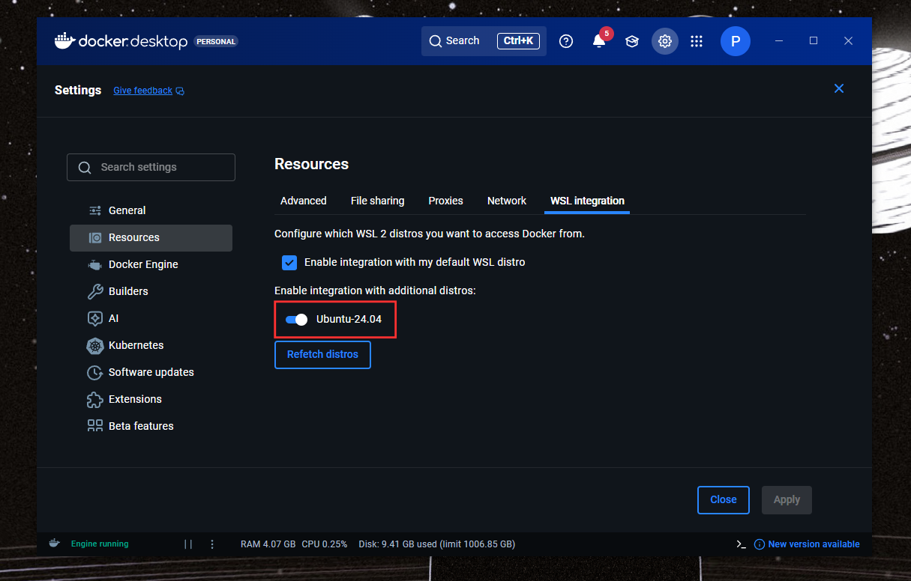

# ติดตั้งDocker Desktop

กด Download Docker

<figure><figcaption></figcaption></figure>

หลังจารเราติดตั้ง Docker เสร็จเรียบร้อยเข้าเรากดเข้ามาที่ตั้งค่า

<figure><figcaption></figcaption></figure>

ไปที่ Resources&#x20;

<figure><figcaption></figcaption></figure>

เข้าไปที่ WSL เปิด Ubuntu 24 เราก็จะสามารถใช้งานกับ project ได้เเล้ว

<figure><figcaption></figcaption></figure>

เราก็สามารถเปิดปิด Containers ได้เเล้วเเล้วทำอย่างอื่นได้ เช่น ลบ imags ต่างๆ

<figure><figcaption></figcaption></figure>

> Docker คือเครื่องมือทำให้เราทำงานสะดวกขึ้น
