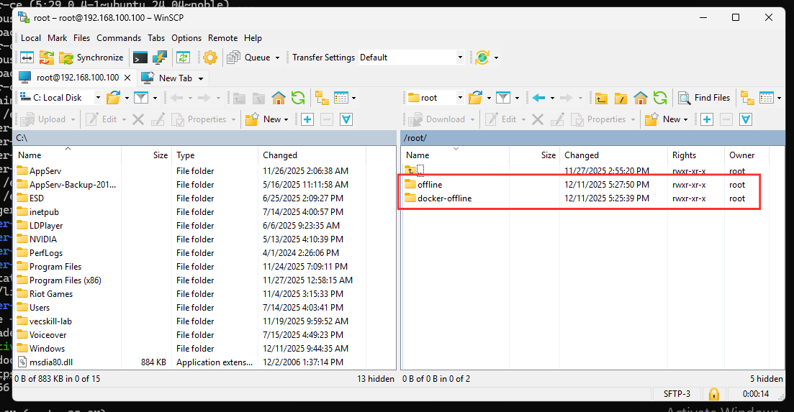

# การโยนไฟล์ลงเครื่อง Server เพื่อติดตั้ง docker offline

### ติดตั้ง WinSCP บนเว็บไซต์

<figure><figcaption></figcaption></figure>

### โยนไฟล์ที่ผมให้ไปลงไปใน Proxmox Server ลงที่ root

<figure><figcaption></figcaption></figure>


อย่าโยนลงผิด Folder !!

