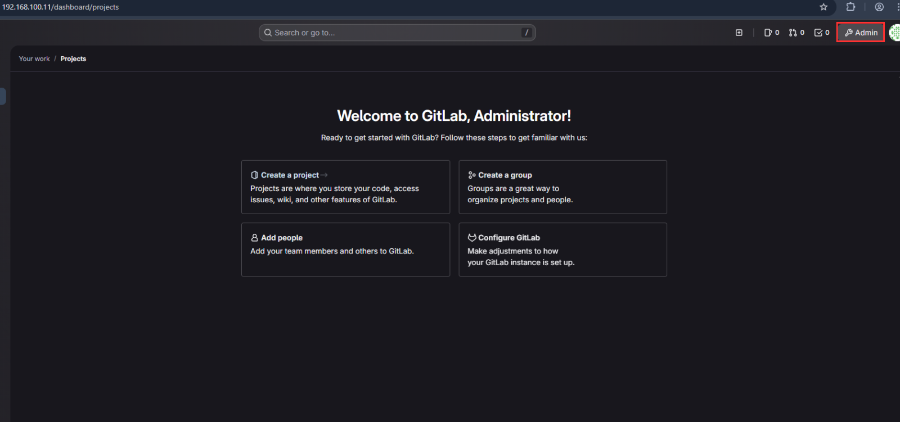
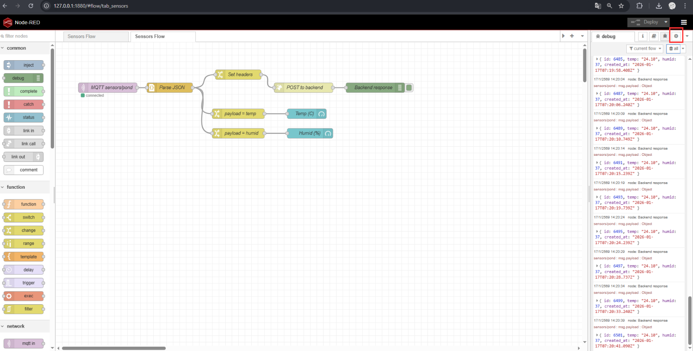
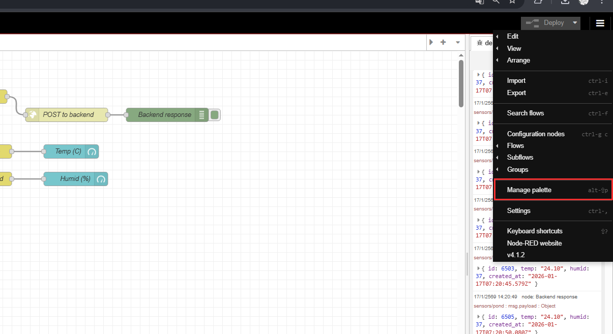
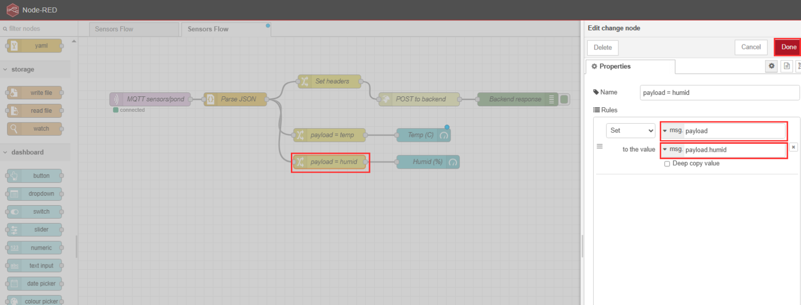
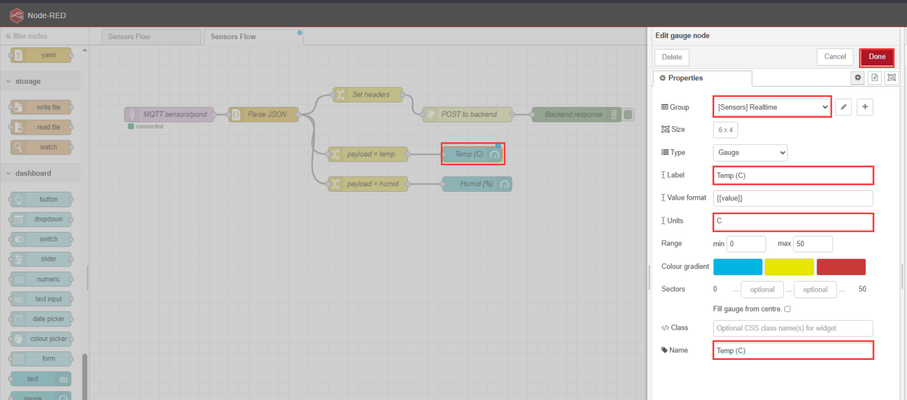
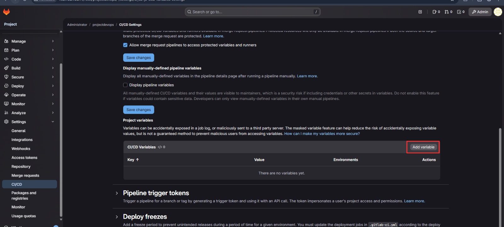
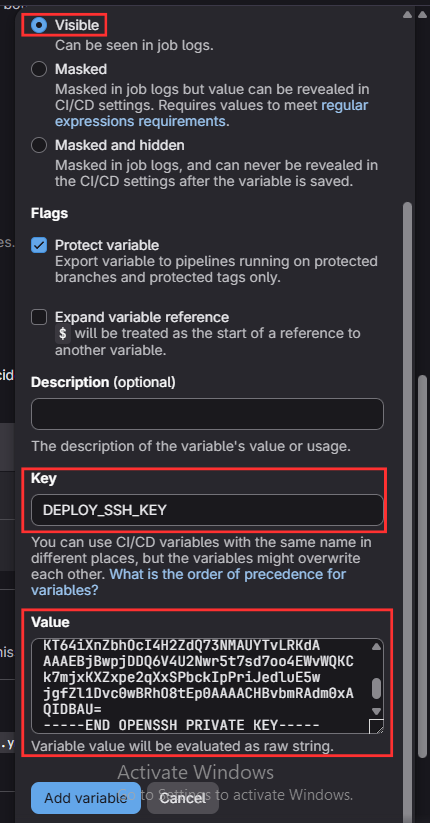
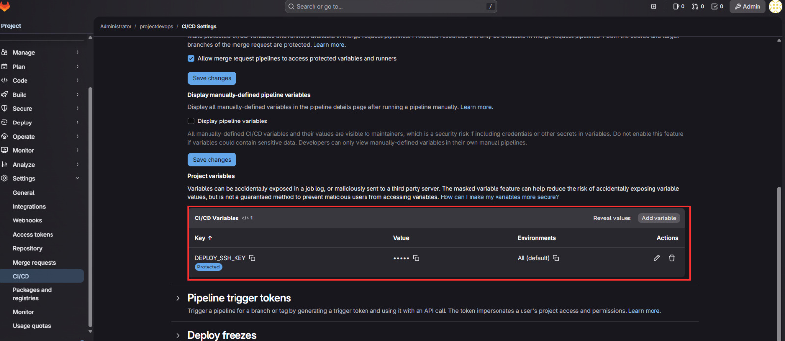
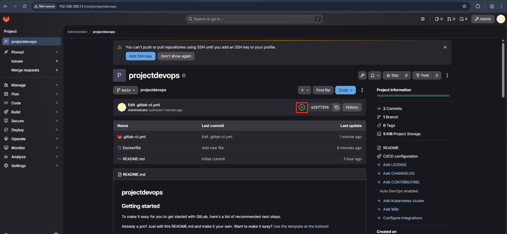

# ทำ CI/CD Pipeline

## เริ่มเเรกเราจำสร้าง repo ไว้ก่อนกดไปที่ Admin

<div align="left"><figure><figcaption></figcaption></figure></div>

## กด Create Project

<figure><figcaption></figcaption></figure>

## ใส่ชื่อ Project ของเราเเละกด Create Project

<figure><figcaption></figcaption></figure>

## เราก็จะได้ repo เพื่อทำ CI/CD Pipeline

<figure><figcaption></figcaption></figure>

## ต่อไปให้เราไปทำที่ VM1 เเละ VM2

```shellscript
sudo apt update
sudo apt install -y openssh-server

เสร็จแล้วเช็คว่า service รันหรือยัง
sudo systemctl status ssh

#ตัวอย่างการเข้า terminal
ssh pond@192.168.100.10

#ถ้า terminal เข้าไม่ได้ได้ให้
ssh-keygen -R 192.168.100.10

#เข้า ssh pond@192.168.100.10 ก็จะสามารถ remote จาก terminal ได้ของ VM1
#ให้เราติดตั้ง gitlab server gitlab runer ให้เรียบร้อย บนVM1
pond@vm1:~$ 

#ให้ใช้คำสั่งนี้เข้าไปเเก้ 
sudo docker exec -it gitlab-ce bash
#จะได้หน้าตาเเบบนี้
root@192:/#

#ให้ติดตั้ง nano ก่อน
apt update
apt install -y nano

#เเละเข้าไปเเก้ไฟล์
nano /etc/gitlab/gitlab.rb 

#ใช้คำสั่ง Ctrl+W เเละหา gitlab_rails['gitlab_shell_ssh_port']
#เสร็จให้ กด Ctrl+O เพื่อ save เเล้วกด Enter 
gitlab_rails['gitlab_shell_ssh_port'] = 22    #ให้ลบ # ออก

#ให้ใช้คำสั่งนี้หลังจากเเก้เสร็จเเละ exit หลังเสร็จ
root@192:/# gitlab-ctl reconfigure
#รอจนขึ้น 
gitlab Reconfigured!
root@192:/# exit
pond@vm1:~$ #ออกมาหน้าปกติ

#ให้เราให้ไปที่ VM2 เตรียม VM2 ให้รับ deploy ด้วย SSHเช็ค SSH
pond@vm2:~$ sudo systemctl status ssh

#กลับไปที่ VM1 ทำ key สำหรับ CI → เข้า VM2 (ฝั่ง CI)
pond@vm1:~$ ssh-keygen -t ed25519 -f ~/ci_deploy_key -N ""

#จะได้เเบบนี้
Generating public/private ed25519 key pair.
Your identification has been saved in /home/pond/ci_deploy_key
Your public key has been saved in /home/pond/ci_deploy_key.pub
The key fingerprint is:
SHA256:gjEt6+6wGp8DDxuxxxxxx pond@vm1

#ให้เรา copy ไปยัง VM2
ssh-copy-id -i ~/ci_deploy_key.pub pond@192.168.100.21

#เสร็จจะขึ้น
Number of key(s) added: 1

#ทดสอบด้วยคำสั่งนี้ จะได้คำว่าปอนด์มาคือได้เเล้ว
pond@vm1:~$ ssh -i ~/ci_deploy_key pond@192.168.100.21 "whoami"
pond

#ให้กลับไปที่ VM2 ตั้ง Deploy Key ให้ VM2 clone repo จาก GitLab (VM2 → GitLab)
#public key ไปใส่ใน GitLab ผมทำ page ไว้เเยก
pond@vm2:~$ ssh-keygen -t ed25519 -f ~/.ssh/gitlab_deploy -N ""
pond@vm2:~$ cat ~/.ssh/gitlab_deploy.pub
ssh-ed25519 AAAAC3NzaC1lZDI1NTE5AAAAICRTOUF5NRApfudFVSZ5h4S0+Atwa7zIiv/8sxRKh63M pond@vm2

#เสร้จจากนั้นตั้ง ~/.ssh/config บน VM2
nano ~/.ssh/config
#พิมพ์คำสั่งนี้ลงไป เสร็จให้ กด Ctrl+O เพื่อ save เเล้วกด Enter
Host gitlab
  HostName 192.168.100.11 #เป็น url ของ gitlab
  Port 2222               #เป็น port ของ gitlab server
  User git
  IdentityFile ~/.ssh/gitlab_deploy
  IdentitiesOnly yes
  PreferredAuthentications publickey
  PasswordAuthentication no
  KbdInteractiveAuthentication no

#ตั้ง permission
pond@vm2:~$ chmod 600 ~/.ssh/config
pond@vm2:~$ chmod 600 ~/.ssh/gitlab_deploy

#ทดสอบ VM2 → GitLab
pond@vm2:~$ ssh -T gitlab
Welcome to GitLab, @root! #คือสำเร็จ🎉🎉


```

## ตั้งค่า GitLab CI Variables (สำคัญ)

ให้ไปที่หน้า Project&#x20;

<figure><figcaption></figcaption></figure>

## ตั้งค่า repo ไปที่ CI/CD

<figure><figcaption></figcaption></figure>

## ไปที่ Variables&#x20;

<figure><figcaption></figcaption></figure>

## กดเข้าไป Variables ให้กด Add Variables&#x20;

<figure><figcaption></figcaption></figure>

## ตั้งค่า Visible ใส่ key เป็น `DEPLOY_SSH_KEY` &#x20;

ใส่ Value ด้วยคำสั่ง `cat ~/ci_deploy_key`  เเละ Add Variables

<div align="left"><figure><figcaption></figcaption></figure></div>

## เปิดไฟล์แล้วคัดลอกทั้งก้อน

<figure><figcaption></figcaption></figure>

## ตั้งค่า GitLab CI Variables ก็จะสำเร็จ

<figure><figcaption></figcaption></figure>

## ต่อมาให้เราสร้างโครงสร้างเเบบนี้เพื่อ test Pipeline ก่อน

<figure><figcaption></figcaption></figure>

## ตัวอย่างไฟล์   `.gitlab-ci.yml` Depoly

```shellscript
stages:
  - build  # ขั้นตอนการ build
  - test   # ขั้นตอนการทดสอบ
  - deploy # ขั้นตอนการ deploy

build:
  stage: build
  script:
    - echo "Building Docker image..."  # แสดงข้อความว่าเริ่มการสร้าง Docker image
    - docker build -t myapp:latest .  # สร้าง Docker image โดยใช้ Dockerfile ในโฟลเดอร์ปัจจุบัน
  tags:
    - pond  # ใช้ runner ที่มี tag pond

test:
  stage: test
  script:
    - echo "Running tests..."  # แสดงข้อความว่าเริ่มการทดสอบ
    - echo "All tests passed!"  # แสดงข้อความว่า "ทุกการทดสอบผ่านแล้ว"
  tags:
    - pond  # ใช้ runner ที่มี tag pond

deploy:
  stage: deploy
  script:
    - echo "Deploy to VM2"  # แสดงข้อความว่าเริ่มการ deploy ไปยัง VM2
    - mkdir -p ~/.ssh  # สร้างโฟลเดอร์ ~/.ssh ถ้าไม่มี
    - chmod 700 ~/.ssh  # ตั้งสิทธิ์ให้โฟลเดอร์ ~/.ssh เป็น 700 (เฉพาะเจ้าของเข้าถึงได้)
    - echo "$DEPLOY_SSH_KEY" | tr -d '\r' > ~/.ssh/id_ed25519  # นำค่า SSH private key มาตั้งในไฟล์ id_ed25519 และลบ \r ออก
    - chmod 600 ~/.ssh/id_ed25519  # ตั้งสิทธิ์ให้ไฟล์ id_ed25519 เป็น 600 (เฉพาะเจ้าของอ่านเขียนได้)
    - ssh-keyscan -H 192.168.100.21 >> ~/.ssh/known_hosts  # เพิ่ม public key ของเซิร์ฟเวอร์ใน known_hosts เพื่อหลีกเลี่ยงการเตือนเมื่อเชื่อมต่อ
    - |
      ssh -i ~/.ssh/id_ed25519 pond@192.168.100.21 "  # เข้าสู่เซิร์ฟเวอร์ 192.168.100.21 ด้วย SSH key ที่เตรียมไว้
        mkdir -p ~/deploy-app &&  # สร้างโฟลเดอร์ ~/deploy-app ถ้าไม่มี
        cd ~/deploy-app &&  # เข้าไปในโฟลเดอร์ ~/deploy-app
        if [ -d .git ]; then  # ถ้ามี repository Git อยู่แล้ว
          git pull  # ดึงข้อมูลล่าสุดจาก repository
        else
          git clone git@gitlab:root/projectdevops.git .  # ถ้าไม่มีให้ clone repository ใหม่
        fi
      "
  only:
    - main  # ทำขั้นตอนนี้เฉพาะเมื่อมีการ push ไปที่ branch main
  tags:
    - pond  # ใช้ runner ที่มี tag pond

```

```shellscript
stages:
  - build
  - test
  - deploy

build:
  stage: build
  script:
    - echo "Building Docker image..."
    - docker build -t myapp:latest .
  tags:
    - pond

test:
  stage: test
  script:
    - echo "Running tests..."
    - echo "All tests passed!"
  tags:
    - pond

deploy:
  stage: deploy
  script:
    - echo "Deploy to VM2"
    - mkdir -p ~/.ssh
    - chmod 700 ~/.ssh
    - echo "$DEPLOY_SSH_KEY" | tr -d '\r' > ~/.ssh/id_ed25519
    - chmod 600 ~/.ssh/id_ed25519
    - ssh-keyscan -H 192.168.100.21 >> ~/.ssh/known_hosts
    - |
      ssh -i ~/.ssh/id_ed25519 sry@192.168.100.21 "
        mkdir -p ~/deploy-app &&
        cd ~/deploy-app &&
        if [ -d .git ]; then
          git pull
        else
          git clone git@gitlab:root/projectdevops.git .
        fi
      "
  only:
    - main
  tags:
    - pond

```

ตัวอย่างไฟล์   `Dockerfile`

```shellscript
FROM alpine:3.20
CMD ["sh", "-c", "echo Hello from myapp && sleep 3600"]
```

## หน้าตาใน repo เราต้องมีเเบบนี้

<div align="left"><figure><figcaption></figcaption></figure></div>

## เราก็จะ test สำเร็จ 🎉🎉

<figure><figcaption></figcaption></figure>


สามารถเอางานการจริงมาต่อยอดได้ 🎄

