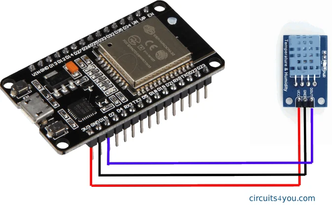

# เตรียมไฟล์ Deploy ระบบจริง

> **การ Deploy ระบบจริง (Production Deployment)** เป็นขั้นตอนสุดท้ายของกระบวนการ DevOps ที่นำระบบจากสภาพแวดล้อมการพัฒนาและทดสอบขึ้นใช้งานจริง โดยอาศัยกระบวนการอัตโนมัติผ่าน GitLab CI/CD เพื่อให้การ Deploy มีความถูกต้อง รวดเร็ว และลดความผิดพลาด บทนี้จะอธิบายแนวคิด ขั้นตอน และแนวทางการ Deploy ระบบให้พร้อมใช้งานในสภาพแวดล้อม Production

โครงสร้างที่เราต้องเตรียมก่อนจะ Deloy มีการบวนทำ stage คือ build, test, deploy จำเป็นต้องมีไฟล์ Dockerfile ไว้ไหนbackend เเละใน fronend ใช้ช้สร้าง image ของฝั่ง Backend (Node/Express) เพื่อรัน API เเละในFrontend/appvue/Dockerfile ใช้สร้าง image ของฝั่ง Frontend (Vue build แล้วเสิร์ฟด้วย Nginx)\
ทั้งคู่ถูกเรียกจาก docker-compose.yml ใน service backend และ frontend ถ้าจะให้กระบวนการ build/test/deploy ทำงานอัตโนมัติบน GitLab CI ก็ต้องดูที่ .gitlab-ci.yml เพราะไฟล์นี้เป็นตัวกำหนดทุกขั้นตอนของ pipeline นั่นเอง

### backend/Dockerfile

* สร้าง image ของฝั่ง Backend (Node/Express) เพื่อรัน API

```javascript
FROM node:20-alpine                 // ใช้ Docker image ของ Node.js เวอร์ชัน 20 บน Alpine (เล็ก เร็ว เหมาะทำ production)
WORKDIR /app                        // ตั้งโฟลเดอร์ทำงานภายใน container เป็น /app

COPY package*.json ./               // คัดลอก package.json และ package-lock.json (ถ้ามี) เข้าไปใน /app
RUN npm ci --omit=dev               // ติดตั้ง dependencies แบบอ้างอิง lockfile ให้ตรงเป๊ะ และไม่ติดตั้ง devDependencies (ประหยัด/เหมาะกับโปรดักชัน)

COPY . .                            // คัดลอกไฟล์ทั้งหมดในโปรเจกต์ (เช่น server.js, routes, src, etc.) เข้าไปใน /app
ENV NODE_ENV=production             // ตั้งค่า environment เป็น production (บาง lib จะทำงานโหมด production เช่นลด log/ปรับ performance)
EXPOSE 3000                         // แจ้งว่า container นี้จะเปิดพอร์ต 3000 (เป็น metadata ให้คนอ่าน/เครื่องมือรู้)
CMD ["node", "server.js"]           // คำสั่งเริ่มรันเมื่อ container start: รัน Node ด้วยไฟล์ server.js

```

### Frontend/appvue/Dockerfile

* สร้าง image ของฝั่ง Frontend (Vue build → เสิร์ฟด้วย Nginx)

```javascript
FROM node:20-alpine AS build                 // สเตจที่ 1 ชื่อ build ใช้ Node.js 20 บน Alpine สำหรับ “build” ไฟล์ frontend
WORKDIR /app                                // ตั้งโฟลเดอร์ทำงานใน container เป็น /app
COPY package*.json ./                       // คัดลอก package.json และ package-lock.json (ถ้ามี) เข้าไปก่อน
RUN npm ci                                  // ติดตั้ง dependencies แบบตรงตาม lockfile เพื่อให้ build ได้เหมือนกันทุกครั้ง
COPY . .                                    // คัดลอกโค้ดทั้งหมดเข้าไปใน /app
RUN npm run build                            // สั่ง build (เช่น Vite/React) ให้ได้ไฟล์ static ออกมาในโฟลเดอร์ dist

FROM 192.168.200.14:5000/nginx:latest        // สเตจที่ 2 ใช้ nginx image จาก private registry ของคุณ เพื่อรันเว็บแบบ static
COPY nginx.conf /etc/nginx/conf.d/default.conf // เอาไฟล์ config nginx ของโปรเจกต์ไปแทนค่า default.conf
COPY --from=build /app/dist /usr/share/nginx/html // คัดลอกไฟล์ที่ build เสร็จแล้วจากสเตจ build ไปไว้ที่โฟลเดอร์เว็บของ nginx
EXPOSE 80                                    // เปิดพอร์ต 80 สำหรับให้คนเข้าผ่าน HTTP
CMD ["nginx", "-g", "daemon off;"]           // สั่ง nginx รันแบบ foreground เพื่อให้ container ไม่ปิดตัวเอง

```

### docker-compose.yml

* ในแต่ละ service จะระบุ build: { context, dockerfile } เพื่อบอกว่าจะใช้ Dockerfile ไหนสร้าง image

```javascript
version: "3.8"                          # เวอร์ชันรูปแบบไฟล์ docker-compose ที่ใช้

services:                               # รวมบริการทั้งหมดที่ต้องรันร่วมกันในโปรเจกต์

  db:                                   # service ชื่อ db คือฐานข้อมูล PostgreSQL
    image: postgres:16                  # ใช้ image postgres เวอร์ชัน 16
    container_name: iot_db              # ตั้งชื่อ container ให้อ่านง่าย
    restart: always                     # ถ้าหลุด/รีบูตเครื่อง ให้พยายามรันใหม่อัตโนมัติ
    environment:                        # ตั้งค่าผ่าน env ให้ postgres สร้าง user/db ตอนเริ่มครั้งแรก
      POSTGRES_USER: pond               # ชื่อผู้ใช้ฐานข้อมูล
      POSTGRES_PASSWORD: "123"          # รหัสผ่านผู้ใช้ฐานข้อมูล
      POSTGRES_DB: bdpond               # ชื่อฐานข้อมูลที่จะสร้าง
    ports:
      - "5432:5432"                     # เปิดพอร์ตจากเครื่องจริง 5432 ไปหา container 5432
    volumes:
      - pgdata:/var/lib/postgresql/data # เก็บข้อมูล DB แบบถาวรไว้ใน volume ชื่อ pgdata กันข้อมูลหายตอนลบ container
    networks:
      - appnet                          # อยู่ใน network เดียวกับบริการอื่น เพื่อให้เรียกกันได้ด้วยชื่อ service

  backend:                              # service ชื่อ backend คือ Node.js API
    build:                              # สร้าง image จาก Dockerfile ในโฟลเดอร์ backend
      context: ./backend                # ตำแหน่งโปรเจกต์ backend
      dockerfile: Dockerfile            # ใช้ไฟล์ Dockerfile ชื่อนี้
    container_name: iot_backend         # ตั้งชื่อ container
    restart: always                     # หลุดแล้วให้รันใหม่
    ports:
      - "3000:3000"                     # เปิดพอร์ต API 3000 ออกมาที่เครื่องจริง
    environment:                        # ตัวแปรแวดล้อมให้ backend ใช้เชื่อม DB และตั้งค่าอื่น ๆ
      DB_HOST: db                       # ให้ต่อฐานข้อมูลผ่านชื่อ service "db" ใน network เดียวกัน
      DB_PORT: "5432"                   # พอร์ตภายในของ postgres
      DB_USER: pond                     # user DB
      DB_PASSWORD: "123"                # password DB
      DB_NAME: bdpond                   # ชื่อ DB

      JWT_SECRET: "change_me_in_vm2_env" # key สำหรับ sign JWT ควรเปลี่ยนในเครื่องจริง/ใช้ .env
      JWT_EXPIRES_IN: "1h"              # อายุ token
      PORT: "3000"                      # พอร์ตที่ backend ฟังใน container
      NODE_ENV: "production"            # โหมดรันแบบโปรดักชัน
    depends_on:
      - db                              # ให้เริ่ม db ก่อน backend (หมายเหตุ: ไม่ได้รอ db พร้อมใช้งาน 100%)
    networks:
      - appnet                          # อยู่ network เดียวกันกับ db และ frontend

  frontend:                             # service ชื่อ frontend คือเว็บหน้า UI (เสิร์ฟด้วย nginx)
    build:                              # สร้าง image จาก Dockerfile ของ frontend
      context: ./Frontend/appvue        # ตำแหน่งโปรเจกต์ frontend
      dockerfile: Dockerfile            # ใช้ Dockerfile ในโฟลเดอร์นี้
    container_name: iot_frontend        # ตั้งชื่อ container
    restart: always                     # หลุดแล้วให้รันใหม่
    depends_on:
      - backend                         # ให้เริ่ม backend ก่อน (หมายเหตุ: ไม่ได้การันตี backend พร้อมตอบ)
    ports:
      - "80:80"                         # เปิดเว็บออกพอร์ต 80 ของเครื่องจริง
    networks:
      - appnet                          # อยู่ network เดียวกันเพื่อเรียก backend ได้

volumes:
  pgdata:                               # ประกาศ volume ชื่อ pgdata สำหรับเก็บข้อมูล postgres แบบถาวร

networks:
  appnet:                               # ประกาศ network ชื่อ appnet ให้ทุก service อยู่ร่วมกัน

```

### **.gitlab-ci.yml**&#x20;

* คือ pipeline ที่สั่ง build/test/deploy อัตโนมัติ
* ในขั้น deploy มันรัน `docker compose up -d --build` บนเครื่องปลายทางคำสั่งนี้จะไปอ่าน docker-compose.yml แล้วใช้ Dockerfile ของแต่ละ service สร้างและรันจริง

```javascript
stages:                                  # กำหนดลำดับ stage ของ pipeline
  - build                                # สร้าง/บิลด์
  - test                                 # ทดสอบ/ตรวจสอบ
  - deploy                               # ดีพลอยขึ้นเครื่องปลายทาง

build:                                   # job ชื่อ build
  stage: build                           # อยู่ใน stage build
  script:
    - echo "Building Docker images..."   # แสดงข้อความ
    - docker build -f backend/Dockerfile -t iotdevops-backend:latest backend
                                         # build docker image ของ backend จาก backend/Dockerfile
                                         # ตั้งชื่อ image เป็น iotdevops-backend:latest
    - docker build -f Frontend/appvue/Dockerfile -t iotdevops-frontend:latest Frontend/appvue
                                         # build docker image ของ frontend จาก Frontend/appvue/Dockerfile
                                         # ตั้งชื่อ image เป็น iotdevops-frontend:latest
  tags:
    - pond                               # ให้รันบน GitLab Runner ที่มี tag pond

test:                                    # job ชื่อ test
  stage: test                            # อยู่ใน stage test
  image: node:22                         # ใช้ image node:22 เพื่อรัน npm
  script:
    - echo "Running tests..."            # แสดงข้อความ
    - cd Frontend/appvue && npm ci && npm run build
                                         # เข้า frontend
                                         # npm ci ติดตั้งตาม lockfile
                                         # npm run build ตรวจว่าบิลด์ผ่าน
    - cd ../../backend && npm ci && (npm run test --if-present || true)
                                         # เข้า backend
                                         # npm ci ติดตั้งตาม lockfile
                                         # npm run test ถ้ามีสคริปต์ test ก็รัน
                                         # || true ไม่ให้ pipeline ล้ม ถ้าไม่มีเทสหรือเทสพัง (ชั่วคราว)
  tags:
    - pond                               # ใช้ runner tag pond

deploy:                                  # job ชื่อ deploy
  stage: deploy                          # อยู่ใน stage deploy
  script:
    - echo "Deploy to VM2"               # แสดงข้อความว่าเริ่ม deploy
    - mkdir -p ~/.ssh                    # สร้างโฟลเดอร์ ~/.ssh
    - chmod 700 ~/.ssh                   # ตั้ง permission ให้ปลอดภัย
    - echo "$DEPLOY_SSH_KEY" | tr -d '\r' > ~/.ssh/id_ed25519
                                         # เอา private key จาก CI variable ชื่อ DEPLOY_SSH_KEY
                                         # ลบ \r กันไฟล์ key มาจาก Windows
                                         # เขียนเป็นไฟล์ ~/.ssh/id_ed25519
    - chmod 600 ~/.ssh/id_ed25519        # ตั้ง permission private key ให้ SSH ยอมใช้
    - ssh-keyscan -H 192.168.100.21 >> ~/.ssh/known_hosts
                                         # เพิ่ม host key ของ VM2 เข้า known_hosts กันค้างตอนถาม fingerprint
    - |
      ssh -i ~/.ssh/id_ed25519 pond@192.168.100.21 "
        mkdir -p ~/deploy-pond &&        # สร้างโฟลเดอร์ deploy บน VM2 ถ้ายังไม่มี
        cd ~/deploy-pond &&              # เข้าโฟลเดอร์ deploy
        if [ -d .git ]; then             # ถ้ามี .git แปลว่าเคย clone แล้ว
          git remote set-url origin git@gitlab:root/testdevops.git &&   # ตั้ง remote ให้ถูก repo
          git fetch origin main &&       # ดึงข้อมูลล่าสุดของ branch main
          git checkout main &&           # สลับไป branch main
          git pull --ff-only origin main # pull แบบ fast-forward เท่านั้น กัน merge อัตโนมัติ
        else                              # ถ้าไม่มี .git แปลว่ายังไม่เคย clone
          git clone git@gitlab:root/testdevops.git .  # clone repo ลงโฟลเดอร์ปัจจุบัน
        fi &&
        docker compose up -d --build     # build และรัน docker compose แบบ background
      "
  only:
    - main                               # รัน deploy เฉพาะตอน push เข้า branch main
  tags:
    - pond                               # ใช้ runner tag pond

# หมายเหตุ
# git clone ใน VM2 จะทำงานได้ก็ต่อเมื่อ VM2 มีสิทธิ์ clone repo จาก GitLab แล้ว
# เช่น ใส่ Deploy Key ของ VM2 ในโปรเจกต์ หรือเพิ่ม user ที่ถูกต้องเป็นสมาชิกโปรเจกต์

```

> ให้เราทำความเข้าใจการใช้ gitlab runner เเละ repo ต่างๆใน gitlab ของเรา

ต่อมาพอเราสร้างไฟล์พวกนี้ครบเราจะ CI/CD pipeline ขั้นตอนการโยนงานขึ้น repo gitlab server ที่เราทำไว้กัน

```shellscript
git init
git add .
git commit -m "init"
git branch -M main
git remote add origin <gitlab-repo-url>
git push -u origin main
```

มันก็จะถาม user กับรหัสที่เราทำ gitlab server ถ้าได้มันก็จะเข้ามาเเบบนี้เเล้ว

<figure><figcaption></figcaption></figure>

> ย้อนกลับไปดูการทำ CI/CD ตอนtset เลยย

<div align="left"><figure><figcaption></figcaption></figure></div>

> ก็จะสามารถ deploy ที่ไป VM 2 ได้เเล้วง่ายนิดเดียว

app vue เราก็จะสามารถใช้งานได้

<figure><figcaption></figcaption></figure>
