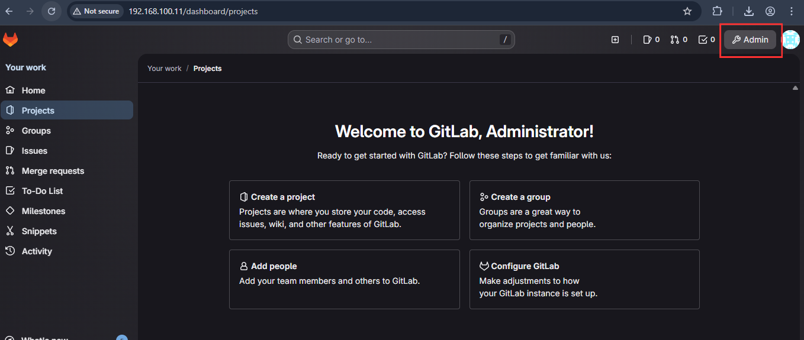
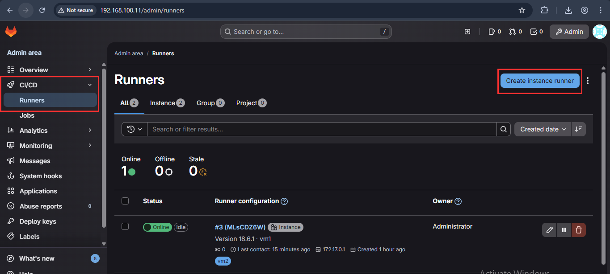
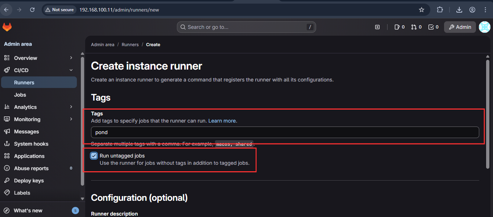
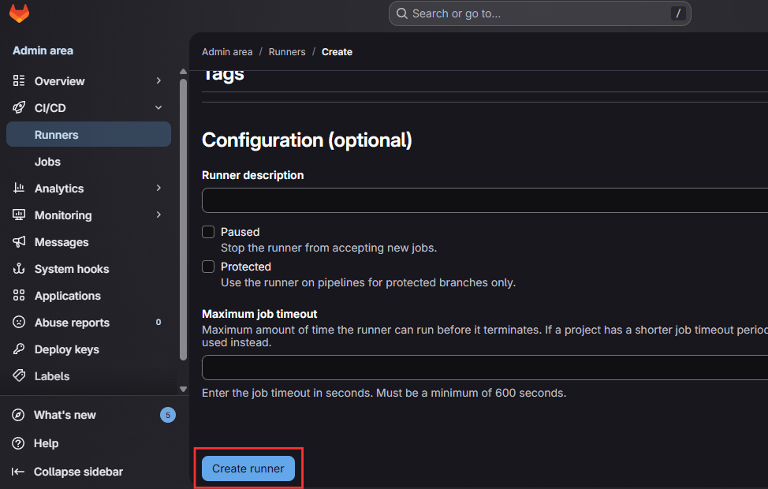
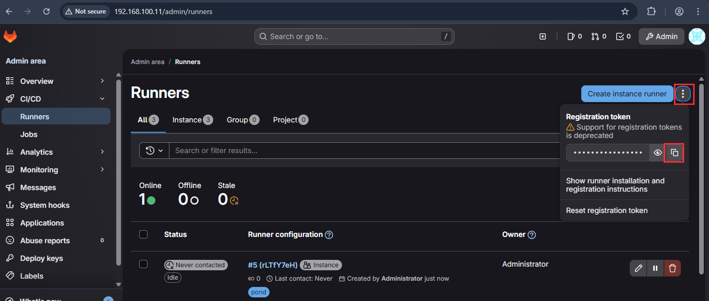

# การสร้าง Gitlab-Runner Register

เข้าไปที่ [`http://192.168.100.11/`](http://192.168.100.11/dashboard/home)  ที่ตั้งไว้ กดไปที่ Admin&#x20;

<div align="left"><figure><figcaption></figcaption></figure></div>

กดที่ CI/CD เเละ Runner สร้าง Create instance runner

<figure><figcaption></figcaption></figure>

เพิ่ม Tags เเล้วติ๊ก Run untagged jobs

<div align="left"><figure><figcaption></figcaption></figure></div>

เลื่อนไปล่างสุดกด Create  runner

<figure><figcaption></figcaption></figure>

Token ที่ต้องใช้เวลา register

<figure><figcaption></figcaption></figure>

```shellscript
#คำสั่งสร้าง register
docker exec -it gitlab-runner gitlab-runner register

#เป็นสร้างหน้า 
Enter the GitLab instance URL (for example, https://gitlab.com/):
http://192.168.100.11/
Enter the registration token:
GmcN4Q4bpxSbmXKxfbpz
Enter a description for the runner:
[ddfbc5e6ac4c]: sry
Enter tags for the runner (comma-separated):
pond
Enter optional maintenance note for the runner:
shell
```
