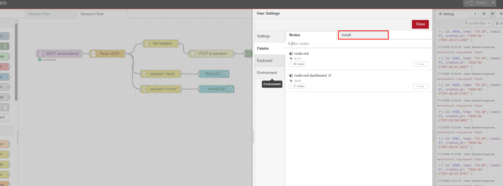
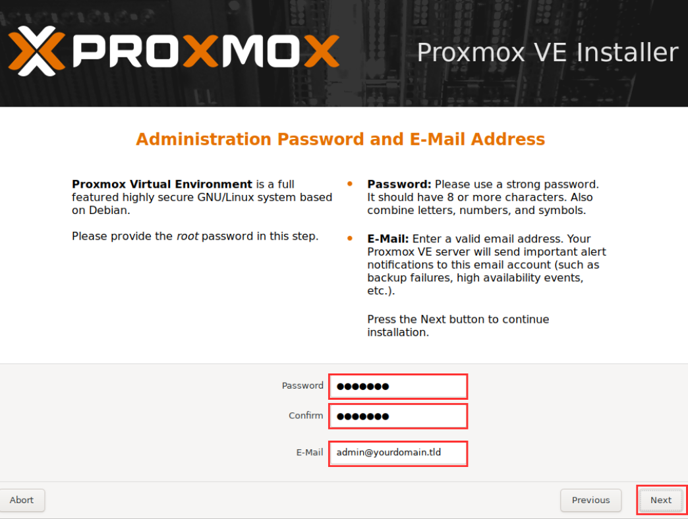

# วิธีการติดตั้ง Proxmox บน Server

## หน้าเลือก Boot เมนูเริ่มติดตั้ง

<figure><figcaption></figcaption></figure>

## หน้ายอมรับเงื่อนไขการใช้งาน

<figure><figcaption></figcaption></figure>

## หน้าตั้งค่า Location / Timezone&#x20;

<figure><figcaption></figcaption></figure>

## หน้าตั้งค่า Root Password + Email ของเราเอง

<figure><figcaption></figcaption></figure>

## หน้าตั้งค่า Network (IP Address / Gateway / DNS)

เป็น IP ที่เราเช็ตไว้เเบบ Static IP เพื่อไม่ให้มีปัญหาเรื่องพอร์ตชนกัน

<figure><figcaption></figcaption></figure>

## หน้าสรุปก่อนติดตั้ง (Summary) ให้กดติดตั้ง

<figure><figcaption></figcaption></figure>

## หน้าหลังติดตั้งเสร็จแล้ว (Installation Complete)  กด Reboot เป็นอันเสร็จ

<figure><figcaption></figcaption></figure>

ใช้เพื่อดู URL สำหรับเข้าเว็บ เช่น `https://192.168.1.10:8006` ตาม IP ที่เราตั้งไว้เราจะเห็นหน้าตา UI

<figure><figcaption></figcaption></figure>

