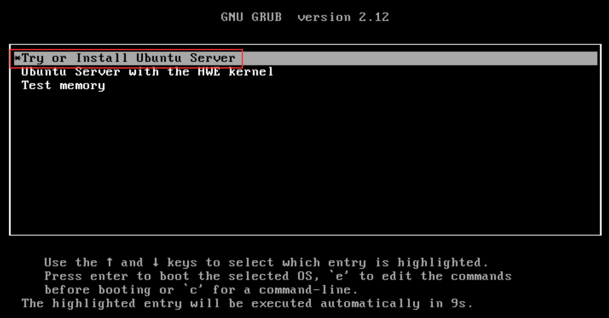
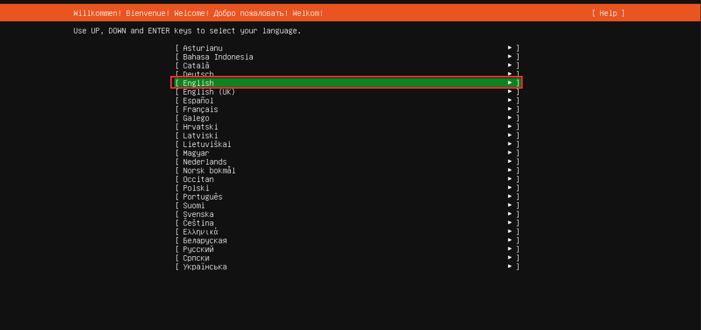
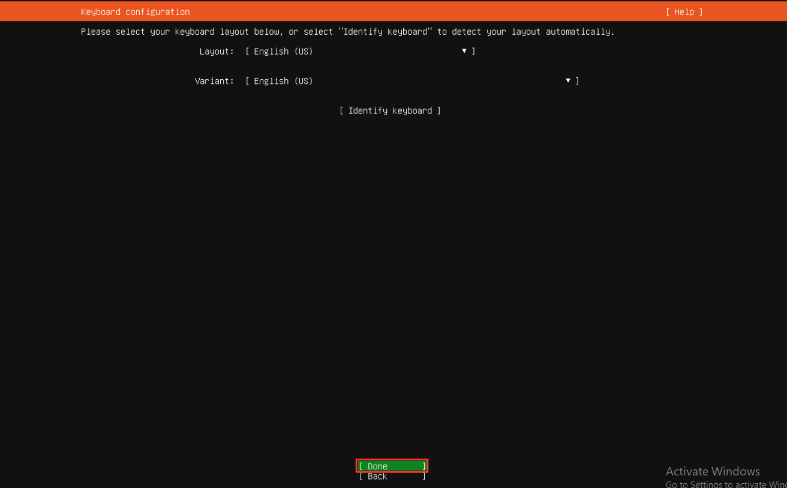
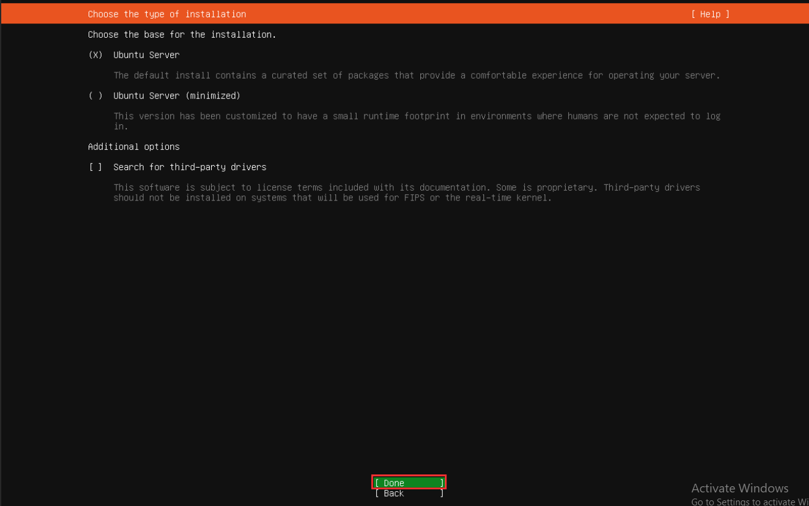
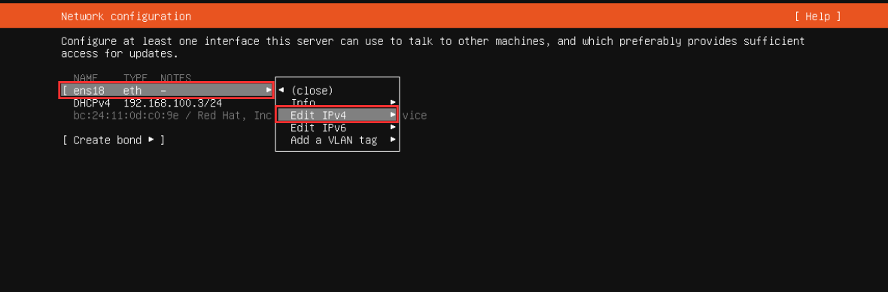
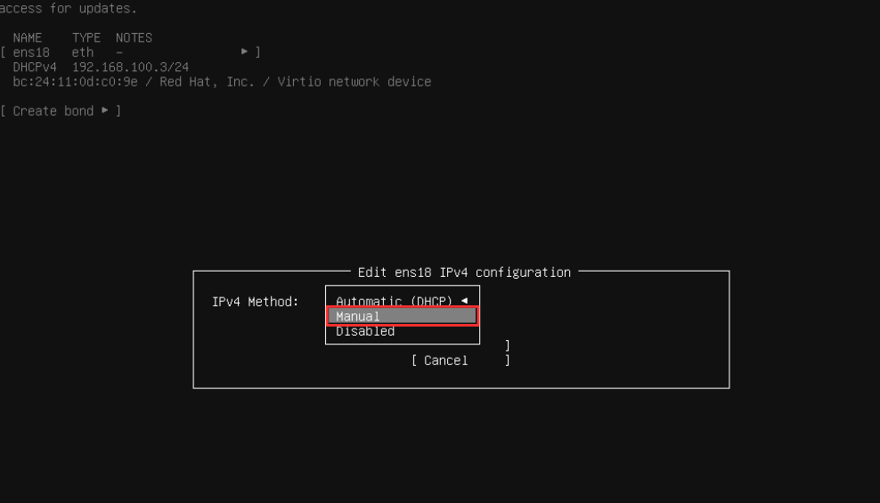
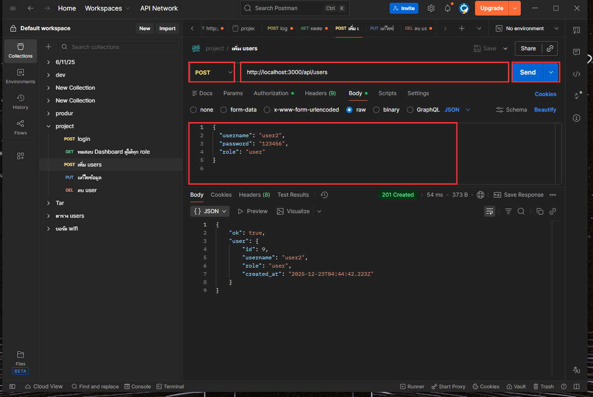
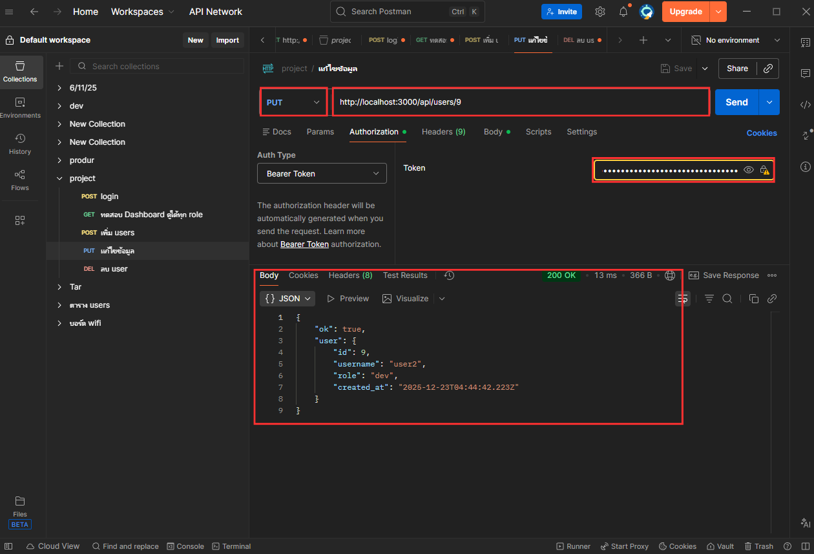
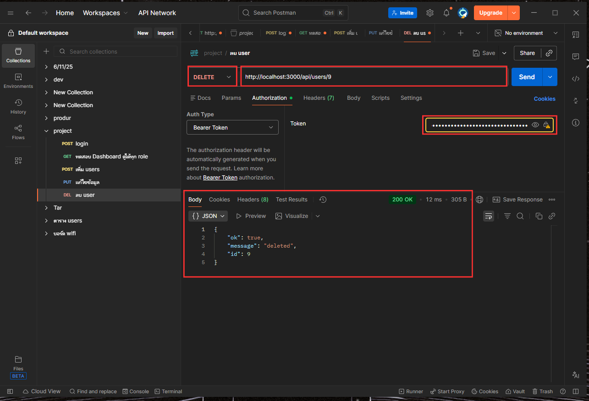
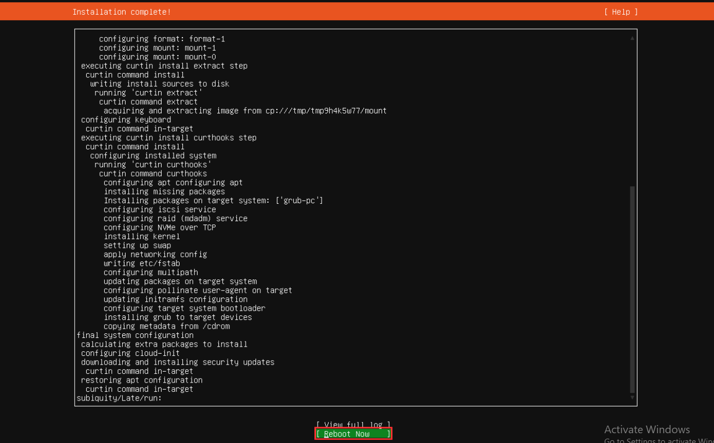

# ติดตั้ง Ubuntu

## Start VM ขึ้นมา

<figure><figcaption></figcaption></figure>

## หน้าเลือกภาษาเลือกตามที่ต้องการได้เลย

<figure><figcaption></figcaption></figure>

## หน้าตั้งค่า keyboard Layout

<figure><figcaption></figcaption></figure>

## หน้าเลือกเวอร์ชั่นให้ Done ต่อ

<figure><figcaption></figcaption></figure>

## หน้าตั้งค่า Network ให้เลือก ether ของเรา Edit IPv4&#x20;

<figure><figcaption></figcaption></figure>

## หน้าตั้งค่า Network ให้เลือกเเบบ manual

<figure><figcaption></figcaption></figure>

## ตั้งค่า Network ให้เราใส่เเบบ Static IP ของเรา&#x20;

<figure><figcaption></figcaption></figure>

## ตั้งค่า Network เสร็จให้เรากด Done ต่อ

<figure><figcaption></figcaption></figure>

## หน้าตั้งค่า Server name สร้าง password ให้เรียบร้อย

<figure><figcaption></figcaption></figure>

## พอติดตั้งเสร็จให้กด Reboot&#x20;

<figure><figcaption></figcaption></figure>

## Reboot เสร็จเราก็จะ login ได้เเล้ว

<figure><figcaption></figcaption></figure>

> ลอง ping _Gateway ดูว่าเน็ตมาเเล้ว_  `Reply from 8.8.8.8: bytes=32 time=6ms TTL=112`
