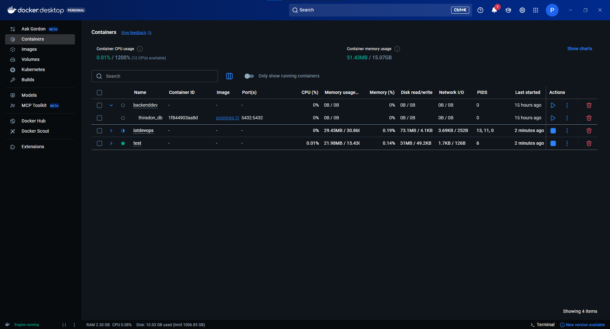

# เเบบฝึกหัด

### สร้างไฟล์ docker-compose.yml Database + เชื่อมต่อใน db.js + ใช้ Docker Desktop

**สิ่งที่ต้องส่ง** โค้ด db.js ที่เชื่อมต่อจริง
ภาพ/หลักฐานว่า container และ volume ถูกสร้างแล้ว (เช่น docker ps, docker volume ls)
&#x20;เกณฑ์ผ่าน

รีสตาร์ท container แล้วข้อมูลยังอยู่ (แปลว่า volume ใช้ได้จริง)
\
แอปเชื่อม DB ได้

รูปภาพตัวอย่าง container บน Docker Desktop

<figure><figcaption></figcaption></figure>


สามารถใช้งานได้

